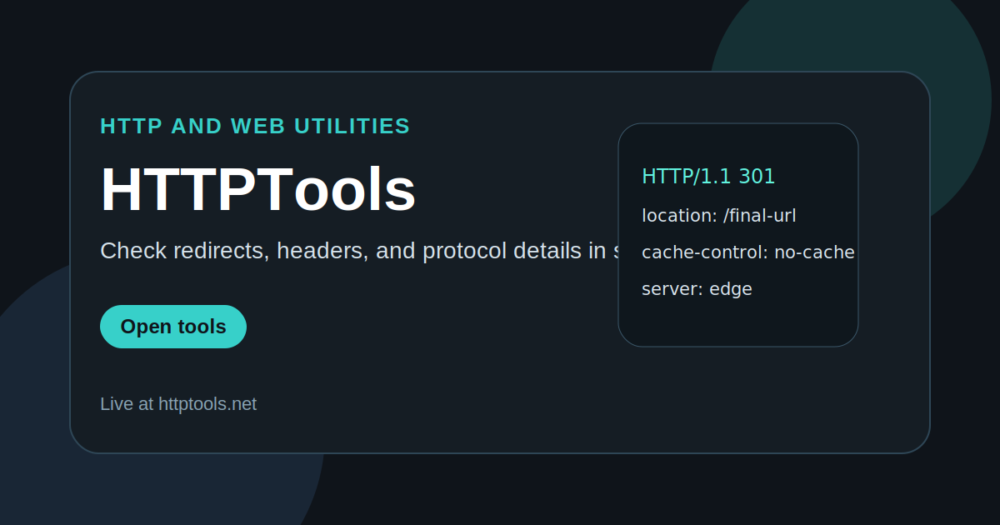

<h1 align="center">HTTPTools</h1>

  Small browser utilities for checking headers, redirects, status codes, and everyday HTTP behavior without local setup.

  <a href="https://httptools.net/"><strong>Open Tools</strong></a>
  ·
  <a href="https://github.com/ivanlukichev/HTTPTools"><strong>GitHub Repo</strong></a>
  ·
  <a href="https://github.com/ivanlukichev"><strong>More Projects</strong></a>

  

## What It Is

HTTPTools is a collection of focused utilities for quick technical checks around requests, responses, headers, and redirect behavior. It is designed for developers, SEO specialists, and anyone who needs a fast answer without opening a full desktop toolchain.

This public repository is the lightweight GitHub face of the project: one page that explains the product and links directly to the live utility hub.

## Typical Uses

- inspect response headers
- check redirect chains
- review status codes
- validate URLs during debugging
- run quick technical checks for SEO work

## Why It Feels Different

- Each tool is scoped to a practical daily task.
- The site removes setup friction for simple technical checks.
- It serves both developer workflows and SEO workflows.
- The public repo is structured to be understandable at a glance.

## Project Snapshot

- Category: web and HTTP utilities
- Audience: developers, SEO specialists, technical users
- Stack: static front end
- Product goal: quick answers for common protocol-level questions

## More Projects

| Project | Live site | Public repo |
| --- | --- | --- |
| PickWinner | [pickwinner.tools](https://pickwinner.tools/) | [pickwinner](https://github.com/ivanlukichev/pickwinner) |
| PickHeadphones | [pickheadphones.com](https://pickheadphones.com/) | [PickHeadphones](https://github.com/ivanlukichev/PickHeadphones) |
| CalcSprint | [calcsprint.com](https://calcsprint.com/) | [CalcSprint](https://github.com/ivanlukichev/CalcSprint) |
| Number Hunt | [numberhuntgame.com](https://numberhuntgame.com/) | [numberhuntgame](https://github.com/ivanlukichev/numberhuntgame) |
| PlayMathPuzzles | [playmathpuzzles.com](https://playmathpuzzles.com/) | [PlayMathPuzzles](https://github.com/ivanlukichev/PlayMathPuzzles) |
| Sudoku Play | [sudoku-play.org](https://sudoku-play.org/) | [Sudoku-Play](https://github.com/ivanlukichev/Sudoku-Play) |
| SkillSudoku | [skillsudoku.com](https://skillsudoku.com/) | [skillsudoku_public](https://github.com/ivanlukichev/skillsudoku_public) |
| BlockPlay | [blockplaygame.com](https://blockplaygame.com/) | [BlockPlay-Game](https://github.com/ivanlukichev/BlockPlay-Game) |

## Visit

  <a href="https://httptools.net/"><strong>Open HTTPTools</strong></a> 
  Small web utilities for fast HTTP checks and technical debugging.

